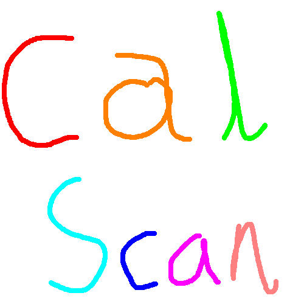
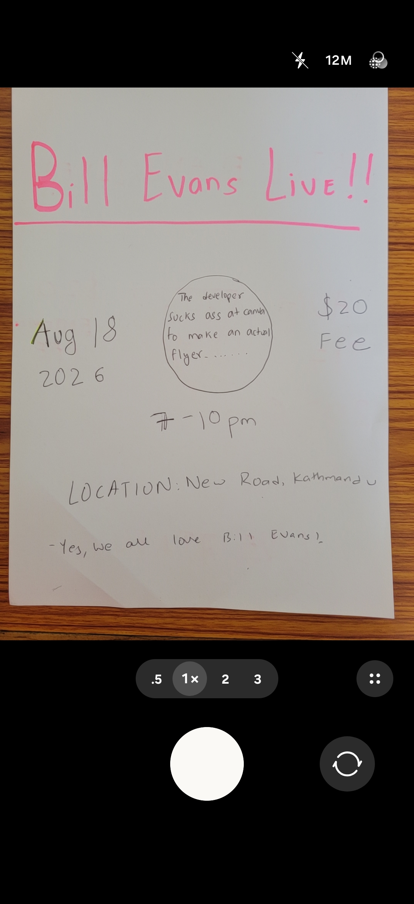
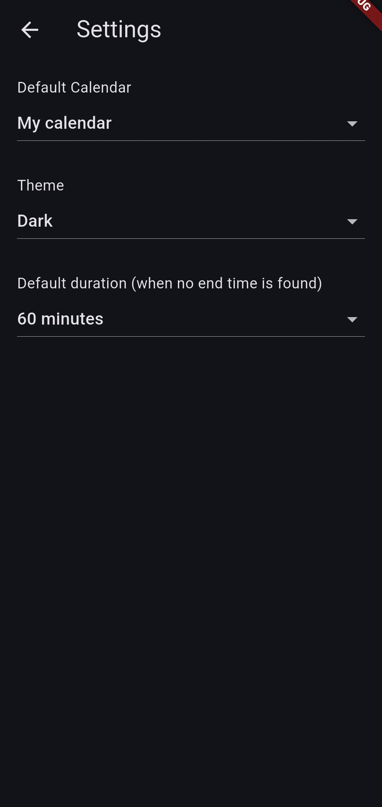
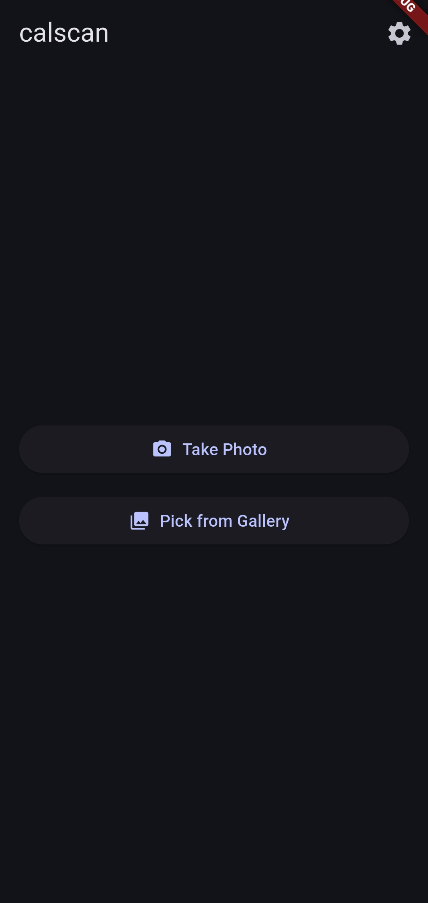
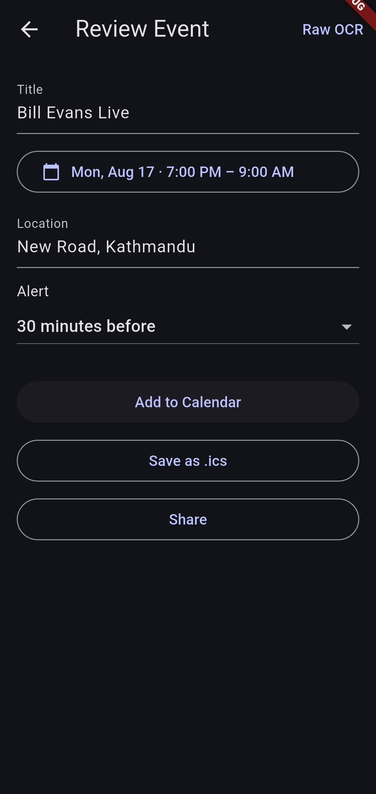

 
[calscan.koirala.xyz](https://calscan.koirala.xyz) 

Scan event flyers and add them to your calendar...FAST!

CalScan is a privacy-focused cross-platform mobile app to directly convert images of posters, flyers and announcements into a calendar event.

Coming to Google Play and App Stores soon (...I hope so!!!!).
- [Download](https://github.com/Anaya-Koirala/calscan/releases/download/Android-APK/app-release.apk) the APK  
- [Download](https://github.com/Anaya-Koirala/calscan/releases/download/Android-APK/app-release.apk.sha1) the SHA1 File Checksum 

## Features
- Scan from your camera or gallery
- Crop the flyer before processing
- Extract key event details with OCR
- Review and edit the title, location, date, and time before saving
- Pick a default calendar and reminder settings
- Add events directly to your device calendar
- Export the event as an `.ics` file for sharing or backup
- No internet connection 
- No server-side processing
- No third-party API dependency
- No LLM integration

## Screenshots

  
  
  
  

## Tech stack

- Flutter: https://github.com/flutter/flutter
- Google ML Kit Text Recognition: https://github.com/flutter-ml/google_mlkit_flutter
- Image Picker: https://github.com/flutter/packages/tree/main/packages/image_picker
- Image Cropping: https://github.com/hnvn/flutter_image_cropper
- Device Calendar integration: https://github.com/builttoroam/device_calendar
- Share Plus: https://github.com/fluttercommunity/plus_plugins/tree/main/packages/share_plus
- Path Provider: https://github.com/flutter/packages/tree/main/packages/path_provider
- Shared Preferences: https://github.com/flutter/packages/tree/main/packages/shared_preferences
- Timezone: https://github.com/srawlani/timezone
- File Picker: https://github.com/miguelpruivo/flutter_file_picker
- iCalendar support: https://github.com/Enough-Software/enough_icalendar
- Open File X: https://github.com/jamesdixon/open_filex

## Contribution and Contact

- Any contribution or feedback is deeply appreciated. (I am still learning Flutter)
- Email: anaya [at] koirala [dot] xyz
- Website: <a href="https://koirala.xyz">koirala.xyz</a>

## TODO

- Improve the OCR and Classification Heuristics
- Create a comprehensive test suite for all kinds of flyers
- User opt-in LLM integration for complex flyers (User provides the API Key)
- Improve overall look and feel, while keeping a minimalist design